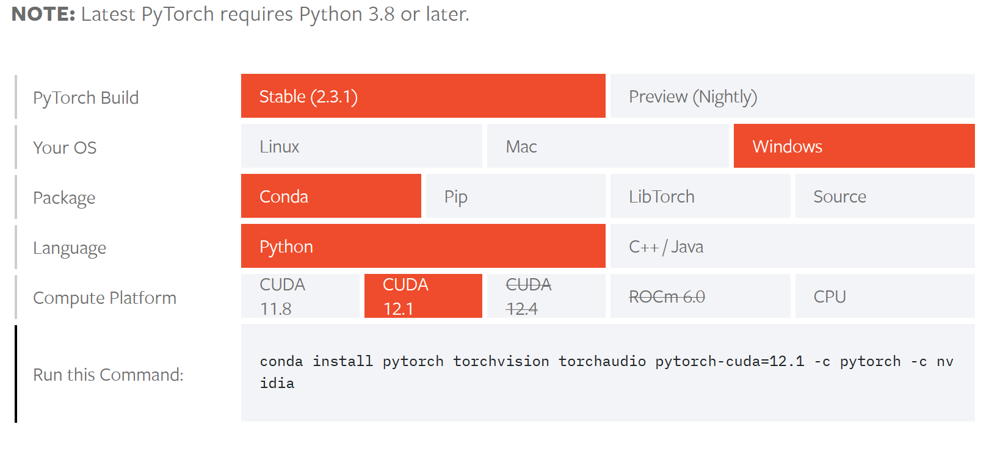

## 概念介绍


> NVIDIA-SMI

这是一个**命令行工具**，允许用户查询和管理NVIDIA GPU的状态。

通过NVIDIA-SMI，可以查看显卡的使用情况（如显存、温度、功率等），运行中的进程，以及相关的驱动版本和CUDA版本等信息。

例如，运行`nvidia-smi`命令可以显示当前系统中所有NVIDIA显卡的状态信息。

```bash
C:\Users\Administrator>nvidia-smi
Wed Jun 12 18:32:28 2024
+---------------------------------------------------------------------------------------+
| NVIDIA-SMI 531.61                 Driver Version: 531.61       CUDA Version: 12.1     |
|-----------------------------------------+----------------------+----------------------+
| GPU  Name                      TCC/WDDM | Bus-Id        Disp.A | Volatile Uncorr. ECC |
| Fan  Temp  Perf            Pwr:Usage/Cap|         Memory-Usage | GPU-Util  Compute M. |
|                                         |                      |               MIG M. |
|=========================================+======================+======================|
|   0  NVIDIA GeForce GTX 1050       WDDM | 00000000:01:00.0 Off |                  N/A |
| N/A   41C    P8               N/A /  N/A|    149MiB /  3072MiB |      3%      Default |
|                                         |                      |                  N/A |
+-----------------------------------------+----------------------+----------------------+

+---------------------------------------------------------------------------------------+
| Processes:                                                                            |
|  GPU   GI   CI        PID   Type   Process name                            GPU Memory |
|        ID   ID                                                             Usage      |
|=======================================================================================|
+---------------------------------------------------------------------------------------+
```


> 显卡驱动

这是NVIDIA提供的软件，允许操作系统和应用程序与NVIDIA显卡进行通信。

驱动程序负责将高层次的图形和计算指令转化为GPU能够理解的低层次指令，从而发挥显卡的硬件性能。

驱动程序的版本需要与CUDA版本兼容才能正常运行CUDA应用程序。

显卡驱动下载：https://www.nvidia.cn/Download/Find.aspx?lang=cn#

需要注意的是，**更高级的显卡才能支持更高级的显卡驱动**。

> CUDA

CUDA（Compute Unified Device Architecture）是NVIDIA推出的一种并行计算平台和编程模型，允许开发者使用NVIDIA GPU进行高效的并行计算。

CUDA版本代表了CUDA工具包的版本号，包括CUDA编译器、库、调试工具等。

不同版本的CUDA工具包可能需要不同版本的显卡驱动才能正常工作。

CUDA依赖显卡驱动，CUDA的版本要求大于等于某个显卡驱动的版本，比如cuda12.1要求显卡驱动版本>=525.60.13

在计算机上查看CUDA版本：`nvcc -V`或者`nvcc --version`

**高显卡驱动的机器支持低版本的CUDA**

CUDA下载 https://developer.nvidia.com/cuda-toolkit-archive

> cuDNN

cudnn可以被看作是人工智能深度学习计算的加速工具包。

cuDNN（CUDA Deep Neural Network library）：是NVIDIA打造的针对深度神经网络的加速库，是一个用于深层神经网络的GPU加速库。如果你要用GPU训练模型，cuDNN不是必须的，但是一般会采用这个加速库。

CUDA与CUDNN的关系：CUDA看作是一个工作台，上面配有很多工具，如锤子、螺丝刀等。cuDNN是基于CUDA的深度学习GPU加速库，有了它才能在GPU上完成深度学习的计算。它就相当于工作的工具，比如它就是个扳手。但是CUDA这个工作台买来的时候，并没有送扳手。想要在CUDA上运行深度神经网络，就要安装cuDNN，就像你想要拧个螺帽就要把扳手买回来。这样才能使GPU进行深度神经网络的工作，工作速度相较CPU快很多

在计算机上查看CUDNN版本：``

cuDNN下载 https://developer.nvidia.com/rdp/cudnn-archive

> pytorch, torch-cuda, torchvision, torchaudio

PyTorch是一个开源的深度学习框架，广泛用于研究和生产。它提供了灵活的张量计算和自动微分能力。

torch-cuda 是PyTorch的CUDA支持包，使得PyTorch可以利用NVIDIA GPU进行加速计算。不同版本的torch-cuda需要与特定版本的CUDA和NVIDIA驱动兼容。

torchvision 是PyTorch的计算机视觉库

在官网安装pytorch的时候如果选择GPU版本，会顺便安装torch-cuda

官网安装pytorch安装pytorch会顺便安装torchvision

下载地址 https://pytorch.org/get-started/locally/


### 版本对应表

GPU, CUDA Toolkit, CUDA Driver Support Matrix：https://docs.nvidia.com/deeplearning/cudnn/latest/reference/support-matrix.html


## 安装方法

### PyTorch（CPU和Cuda版本）

PyTorch官方提供**最新的**PyTorch安装命令，提供了CPU版和GPU版： https://pytorch.org/get-started/locally/

如下图所示：



同时提供旧版的PyTorch安装方法：https://pytorch.org/get-started/previous-versions/

在安装putorch的同时也会顺便安装好torchvision

### 单独安装torchtext和torchvision

torchtext和torchvision的安装需要和torch版本完全对应。

具体版本对应查看官网 https://pypi.org/project/torchtext/ , https://pypi.org/project/torchvision/

